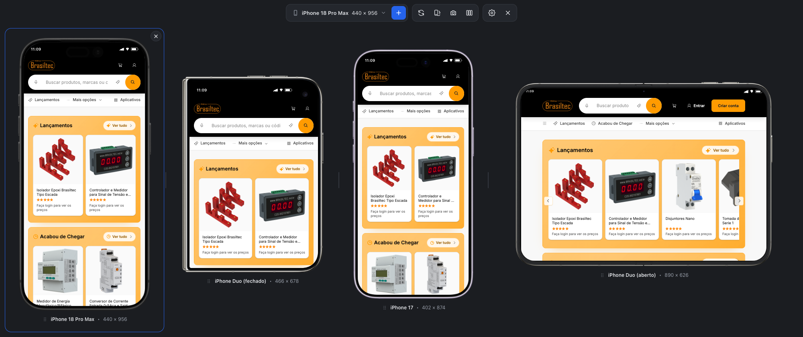

# Flexi Device — Simulador Mobile (extensão Chrome)

Extensão Manifest V3 que mostra o site da aba atual em molduras de iPhone, iPad e Android lado a lado, com user agent mobile real. Sem dependências e sem build.

## Instalar (modo desenvolvedor)

1. Abra `chrome://extensions` e ative **Modo do desenvolvedor**.
2. Clique em **Carregar sem compactação** e escolha esta pasta.
3. Abra qualquer site e clique no ícone da extensão (ou botão direito → *Ativar/desativar Flexi Device*).

Clique de novo no ícone, ou no **X** da barra superior, para sair. A aba é recarregada com os headers normais.

## Como funciona

| Camada | Arquivo | O que faz |
|---|---|---|
| Service worker | `js/background.js` | Ativa/desativa por aba, cria regras `declarativeNetRequest` de sessão (só para aquela aba) que removem `X-Frame-Options` / `Content-Security-Policy` e trocam `User-Agent` + client hints. Injeta o content script e reinjeta após navegação. Faz a captura de tela com `tabs.captureVisibleTab`. |
| Content script | `js/content.js` | Monta a interface dentro de um Shadow DOM (o CSS da página não interfere). Cada dispositivo é um `<iframe>` no tamanho exato do viewport, escalado via `transform` para caber na tela. |
| Estilos | `css/content.css` | Molduras desenhadas em CSS, barras de navegador, painel de definições e temas. |

Os headers só são alterados enquanto o simulador está ativo naquela aba. Ao fechar, as regras são removidas e a aba recarrega.

As molduras são reduzidas com `zoom` (não `transform: scale`) e todas as bordas são alinhadas a pixels inteiros do dispositivo. Isso evita o fio claro que o compositor do Chrome deixa ao redor de um iframe escalado enquanto a página rola.

## Recursos

- Catálogo com 84 dispositivos (`js/devices.js`): iPhones, iPads, Samsung, Google, Xiaomi, Motorola, OnePlus, notebooks e desktops
- Seletor com busca, filtros (ano, Flagship, Top), favoritos e seções por marca; troca de dispositivo direto no cabeçalho de cada moldura
- Dispositivos personalizados (nome, largura, altura, tipo, estilo), salvos em `chrome.storage.local`
- Vários dispositivos ao mesmo tempo, cada um ocupando uma fração igual da tela (1/n), centralizado e escalado para caber
- Arrastar e soltar (pela moldura ou pelo rótulo) para reordenar os dispositivos
- Divisores entre os dispositivos para redimensionar a área de cada um; botão "Reorganizar dispositivos" na barra com duas opções: tamanhos iguais, ou proporcional ao tamanho real (mesma escala para todos, colunas na proporção de cada aparelho)
- Dispositivo selecionado com borda azul; girar, captura e troca de modelo agem sobre ele
- Navegação sincronizada: ao trocar de página em um dispositivo, os outros acompanham (frames da mesma origem da aba)
- Rolagem sincronizada por proporção, com opção para desligar
- Painel de definições (engrenagem): moldura realista (renders PNG), desenhada (CSS) ou nenhuma; UI realista, rolagem sincronizada, tema (sistema/claro/escuro), modo de tela (navegador com barra de URL e toolbar do Safari ou Chrome, PWA só com barra de status, tela cheia), URL e hora personalizadas, user agent
- Molduras fotográficas: 48 renders PNG com a tela transparente em `img/frames/` (fonte e licença em `img/frames/README.md`), cobrindo 82 dos 84 dispositivos; o iframe fica dentro do recorte medido pelo canal alfa. Dispositivos sem render usam a moldura desenhada em CSS
- Seleção de user agent: iOS (Safari), Android (Chrome) ou desktop
- Captura de tela por dispositivo (PNG, recorte da moldura)
- Interface em português (pt-BR) e inglês

## Dispositivos disponíveis

84 dispositivos, 83 com render fotográfico. "render *" indica que o modelo usa o render de um aparelho equivalente, com o mesmo viewport.

### Apple

| Dispositivo | Viewport | Ano | Moldura |
|---|---|---|---|
| iPhone 18 Pro Max · flagship | 440 × 956 | 2026 | render |
| iPhone 18 Pro · top | 402 × 873 | 2026 | render |
| iPhone Duo (aberto) · flagship | 890 × 626 | 2026 | render |
| iPhone Duo (fechado) · flagship | 466 × 678 | 2026 | render |
| iPhone 17 Pro Max · flagship | 440 × 956 | 2025 | render |
| iPhone 17 Pro · top | 402 × 874 | 2025 | render |
| iPhone 17 | 402 × 874 | 2025 | render |
| iPhone Air | 420 × 912 | 2025 | render |
| iPhone 17e | 390 × 844 | 2026 | render * |
| iPhone 16 Pro Max · flagship | 440 × 956 | 2024 | render |
| iPhone 16 Pro · top | 402 × 874 | 2024 | render * |
| iPhone 16 Plus | 430 × 932 | 2024 | render |
| iPhone 16 | 393 × 852 | 2024 | render |
| iPhone 16e | 390 × 844 | 2025 | render * |
| iPhone 15 Pro Max | 430 × 932 | 2023 | render |
| iPhone 15 Pro | 393 × 852 | 2023 | render |
| iPhone 15 Plus | 430 × 932 | 2023 | render |
| iPhone 15 | 393 × 852 | 2023 | render |
| iPhone 14 Pro Max | 430 × 932 | 2022 | render |
| iPhone 14 Pro | 393 × 852 | 2022 | render |
| iPhone 14 Plus | 428 × 926 | 2022 | render * |
| iPhone 13 & 14 | 390 × 844 | 2022 | render |
| iPhone 13 Pro Max | 428 × 926 | 2021 | render |
| iPhone 13 mini | 375 × 812 | 2021 | render |
| iPhone 12 | 390 × 844 | 2020 | render |
| iPhone 11 Pro Max | 414 × 896 | 2019 | render |
| iPhone 11 / XR | 414 × 896 | 2019 | render |
| iPhone X / XS | 375 × 812 | 2017 | render |
| iPhone SE (2022) | 375 × 667 | 2022 | render |
| iPhone 8 Plus | 414 × 736 | 2017 | render * |
| iPad Pro 13 (M4) · flagship | 1032 × 1376 | 2024 | render * |
| iPad Pro 12.9 · flagship | 1024 × 1366 | 2022 | render * |
| iPad Pro 11 · top | 834 × 1194 | 2024 | render |
| iPad Air 13 | 1024 × 1366 | 2024 | render * |
| iPad Air 11 | 820 × 1180 | 2024 | render * |
| iPad (10th gen) | 820 × 1180 | 2022 | render * |
| iPad mini | 744 × 1133 | 2024 | render * |
| iPad (9th gen) | 810 × 1080 | 2021 | render * |

### Samsung

| Dispositivo | Viewport | Ano | Moldura |
|---|---|---|---|
| Galaxy S25 Ultra · flagship | 384 × 832 | 2025 | render * |
| Galaxy S25+ · top | 384 × 832 | 2025 | render * |
| Galaxy S25 | 360 × 780 | 2025 | render * |
| Galaxy S24 Ultra · flagship | 384 × 824 | 2024 | render |
| Galaxy S24 | 360 × 780 | 2024 | render |
| Galaxy S23 | 360 × 780 | 2023 | render * |
| Galaxy Z Flip 6 | 360 × 880 | 2024 | render * |
| Galaxy Z Fold 6 (open) | 768 × 906 | 2024 | CSS |
| Galaxy A55 | 360 × 800 | 2024 | render * |
| Galaxy A15 | 360 × 800 | 2024 | render * |
| Galaxy Tab S9 | 800 × 1280 | 2023 | render * |
| Galaxy Tab A9+ | 800 × 1280 | 2023 | render * |

### Google

| Dispositivo | Viewport | Ano | Moldura |
|---|---|---|---|
| Pixel 10 Pro XL · flagship | 412 × 928 | 2025 | render * |
| Pixel 10 Pro · top | 412 × 915 | 2025 | render |
| Pixel 10 | 412 × 915 | 2025 | render |
| Pixel 9 Pro XL · flagship | 412 × 928 | 2024 | render * |
| Pixel 9 Pro | 412 × 915 | 2024 | render * |
| Pixel 9 | 412 × 915 | 2024 | render * |
| Pixel 9a | 412 × 915 | 2025 | render * |
| Pixel 8 Pro | 412 × 915 | 2023 | render * |
| Pixel 8 | 412 × 915 | 2023 | render |
| Pixel 7 | 412 × 915 | 2022 | render * |
| Pixel Tablet | 800 × 1280 | 2023 | render * |

### Xiaomi

| Dispositivo | Viewport | Ano | Moldura |
|---|---|---|---|
| Xiaomi 15 · flagship | 393 × 873 | 2025 | render * |
| Xiaomi 14 | 393 × 873 | 2024 | render * |
| Redmi Note 14 | 393 × 873 | 2025 | render * |
| Redmi Note 13 | 393 × 873 | 2024 | render * |
| POCO X7 | 393 × 873 | 2025 | render * |

### Motorola

| Dispositivo | Viewport | Ano | Moldura |
|---|---|---|---|
| Moto Edge 50 · top | 412 × 915 | 2024 | render * |
| Moto Razr 50 | 360 × 880 | 2024 | render * |
| Moto G85 | 412 × 915 | 2024 | render * |
| Moto G54 | 412 × 915 | 2023 | render * |
| Moto G24 | 412 × 915 | 2024 | render * |

### OnePlus

| Dispositivo | Viewport | Ano | Moldura |
|---|---|---|---|
| OnePlus 13 · flagship | 412 × 915 | 2025 | render * |
| OnePlus 12 | 412 × 915 | 2024 | render * |
| OnePlus Nord 4 | 412 × 915 | 2024 | render * |

### Huawei

| Dispositivo | Viewport | Ano | Moldura |
|---|---|---|---|
| Huawei P60 Pro | 412 × 915 | 2023 | render * |

### OPPO

| Dispositivo | Viewport | Ano | Moldura |
|---|---|---|---|
| OPPO Find X8 | 412 × 915 | 2024 | render * |

### vivo

| Dispositivo | Viewport | Ano | Moldura |
|---|---|---|---|
| vivo X200 | 412 × 915 | 2024 | render * |

### Nothing

| Dispositivo | Viewport | Ano | Moldura |
|---|---|---|---|
| Nothing Phone (3) | 412 × 915 | 2025 | render * |

### Notebooks e desktops

| Dispositivo | Viewport | Ano | Moldura |
|---|---|---|---|
| MacBook Air 13 · top | 1470 × 956 | 2024 | render * |
| MacBook Pro 14 | 1512 × 982 | 2024 | render * |
| MacBook Pro 16 | 1728 × 1117 | 2024 | render |
| Laptop HD | 1366 × 768 | 2020 | render * |
| Laptop Full HD | 1920 × 1080 | 2020 | render * |
| Desktop QHD | 2560 × 1440 | 2020 | render * |

## Limitações

- Páginas internas do Chrome, a Web Store e `file://` não são suportadas.
- A captura de tela usa a resolução em que a moldura aparece na tela. Dispositivos reduzidos por escala geram imagens menores.
- Sites que detectam iframe por JavaScript (`window.top !== window.self`) podem se comportar diferente.
- Sem gravação de vídeo nesta versão.
